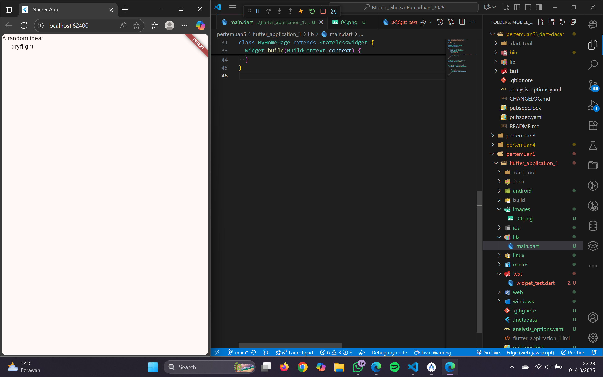
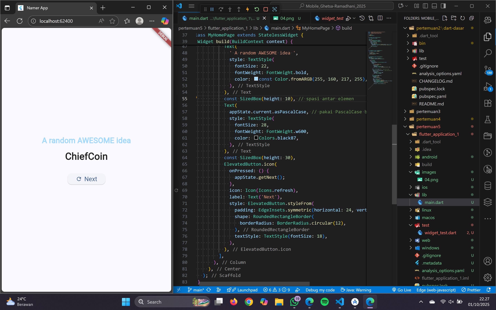
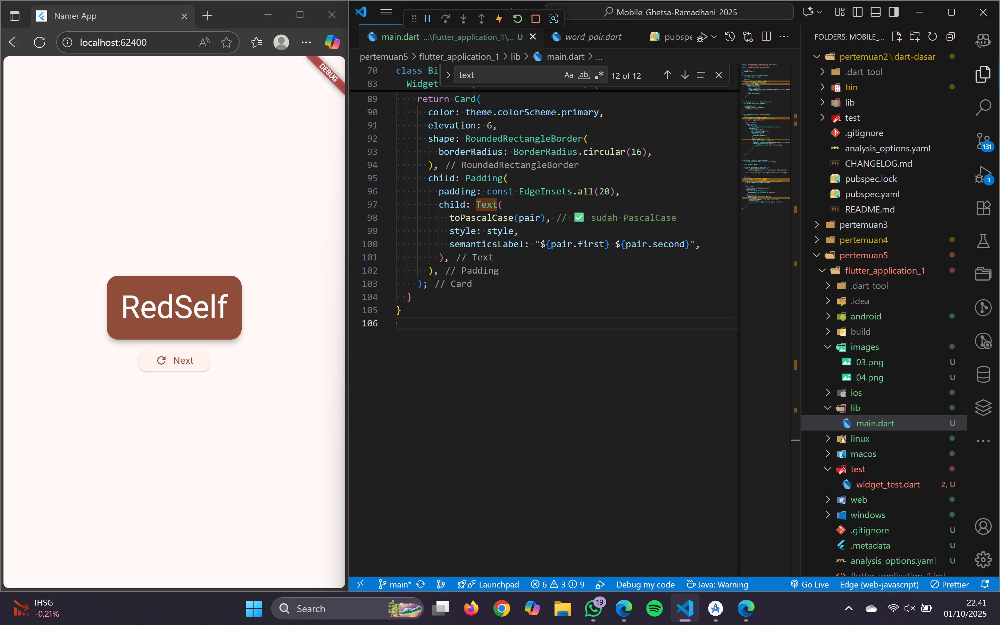
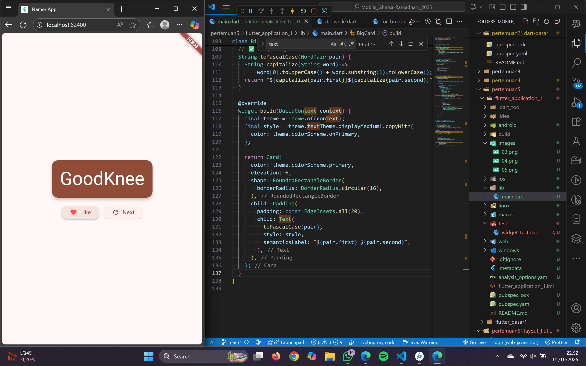
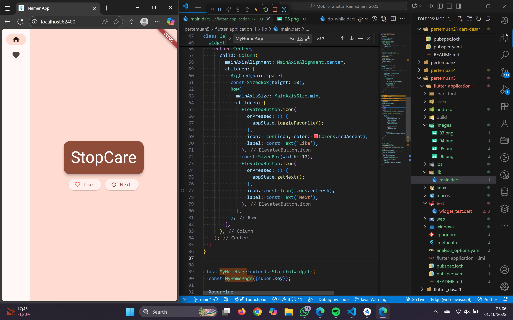
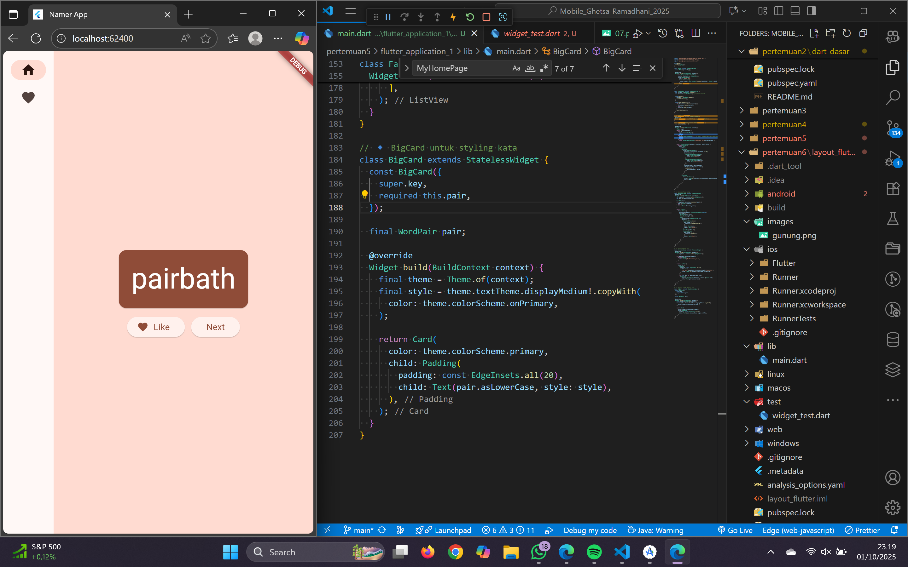
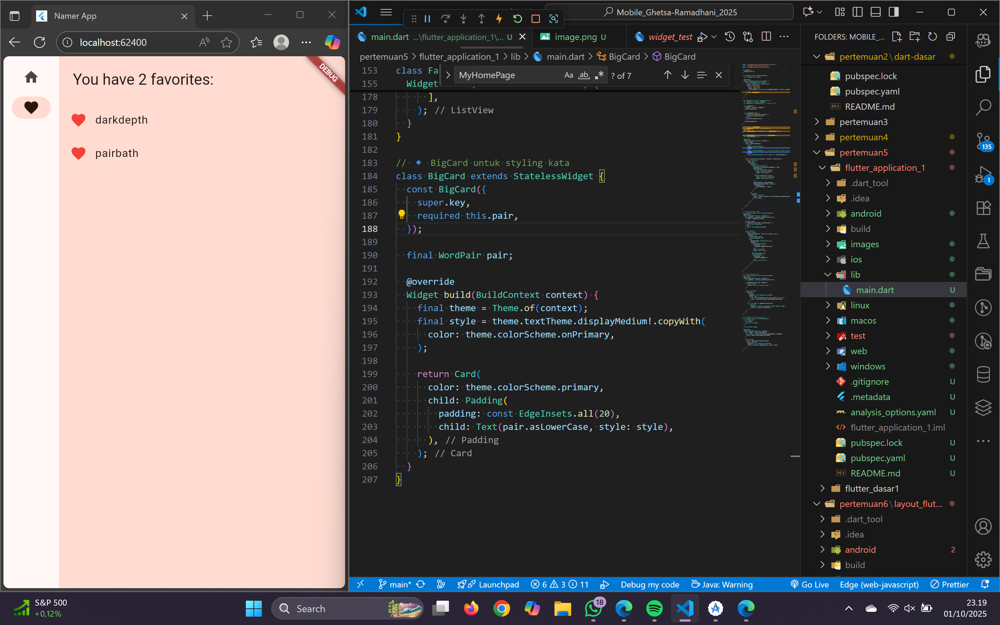

## Codelabs: Your first Flutter app

## 3. Create a project

## 4. Add a button

## 5. Make the app prettier

## 6. Add functionality

## 7. Add navigation rail

## 8. Add a new page

1. Sebelum tombol ditekan

2. Setelah tombol ditekan

