# hello_world

A new Flutter project.

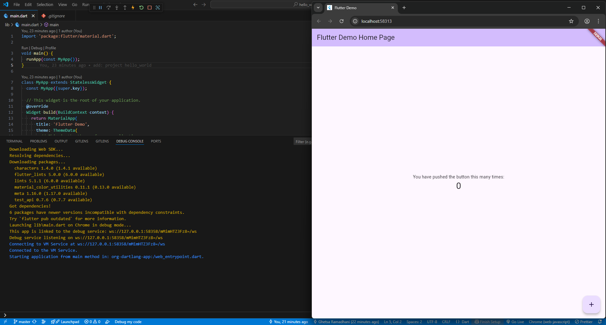

## Praktikum 2
### Menghubungkan ke perangkat android
Berhasil menghubungkan ke perangkat android
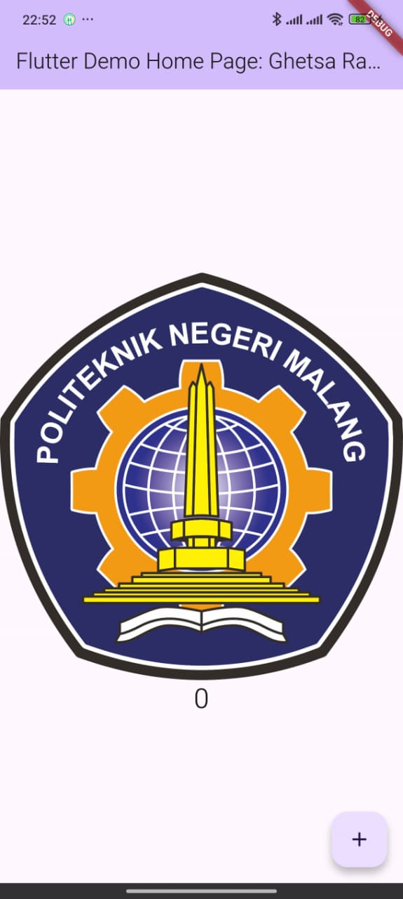

## Praktikum 4
### Text Widget
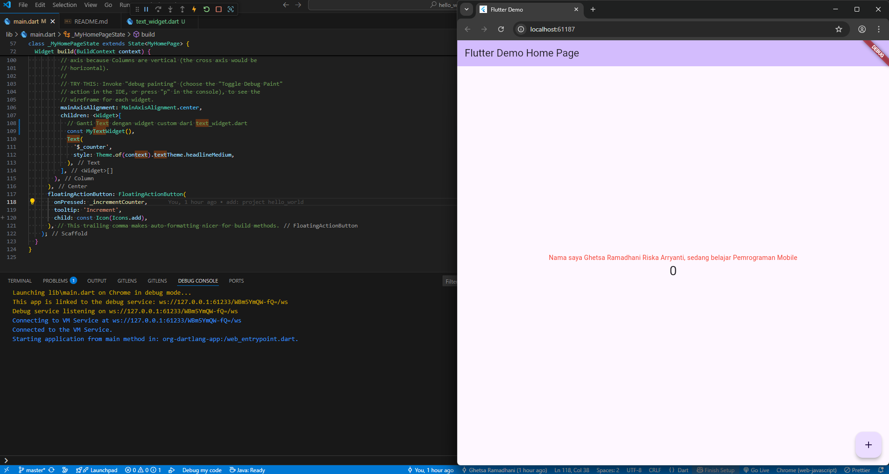

### Image Widget
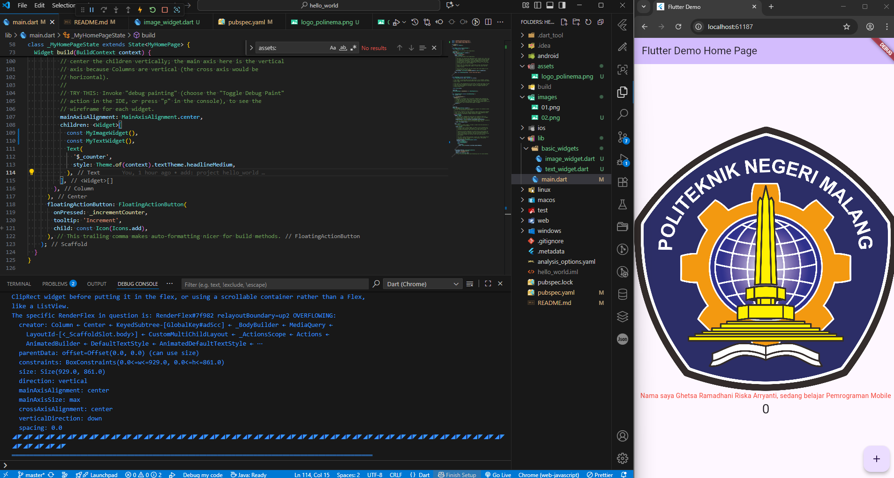

## Praktikum 5
### Cupertino Button dan Loading Bar
1. Sebelum tombol ditekan
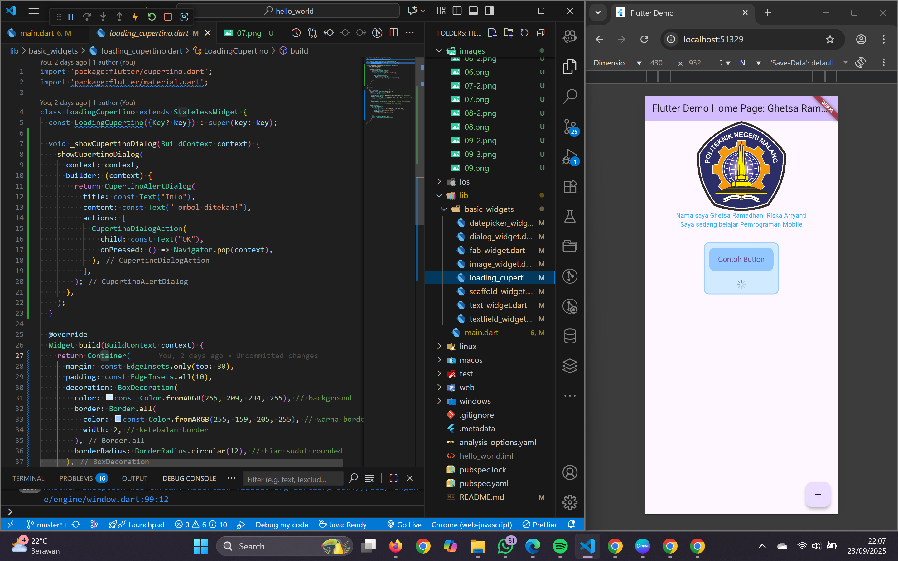

2. Setelah tombol ditekan
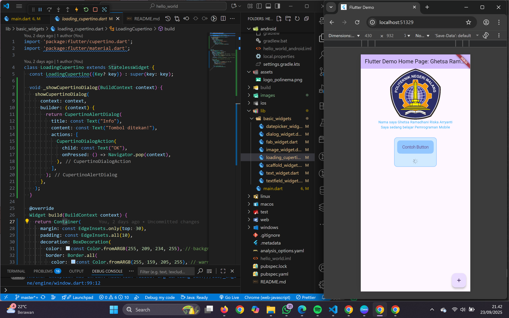

### Floating Action Button (FAB)
1. Sebelum tombol ditekan

2. Setelah tombol ditekan
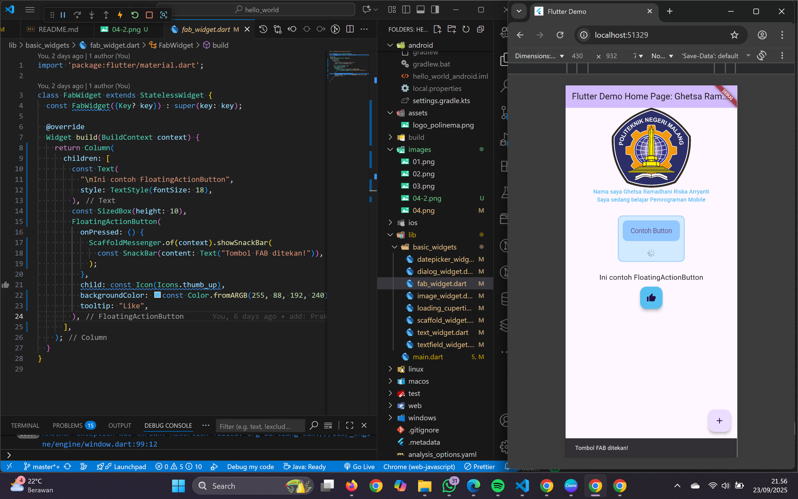

### Scaffold Widget
1. Sebelum tombol ditekan
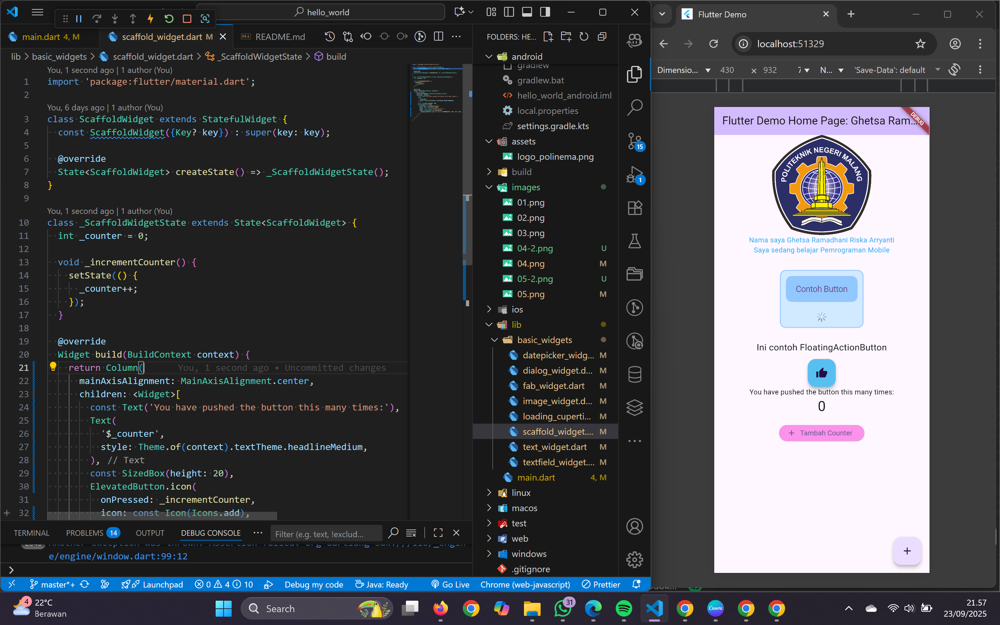

2. Setelah tombol ditekan
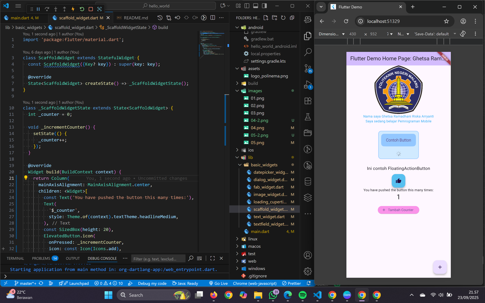

### Dialog Widget
1. Sebelum tombol ditekan
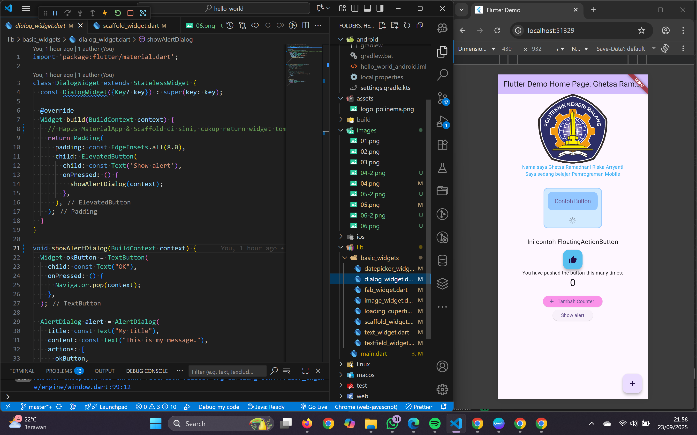

2. Setelah tombol ditekan
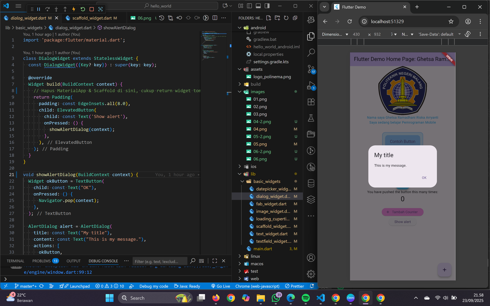

### Input dan Selection Widget
1. Sebelum tombol ditekan

2. Setelah tombol ditekan

### Date and Time Pickers
1. Sebelum tombol ditekan

2. Setelah tombol ditekan dan pilih tanggal
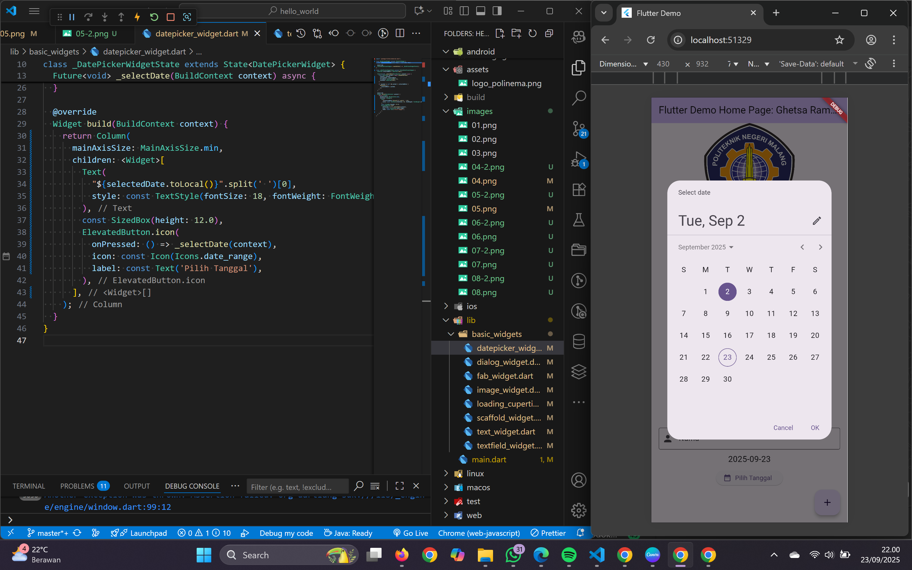

3. Menampilkan tanggal yang dipilih

