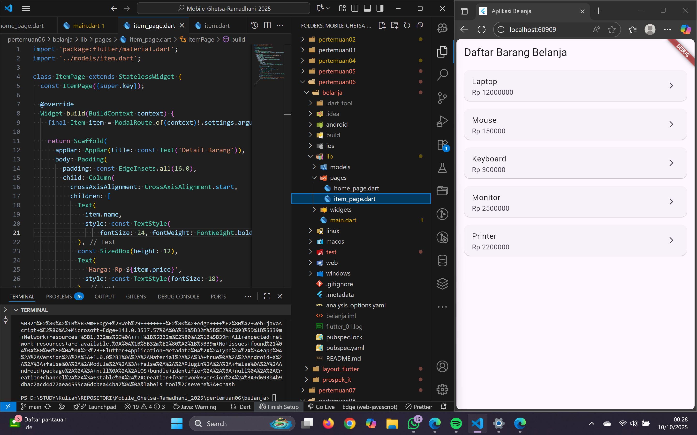
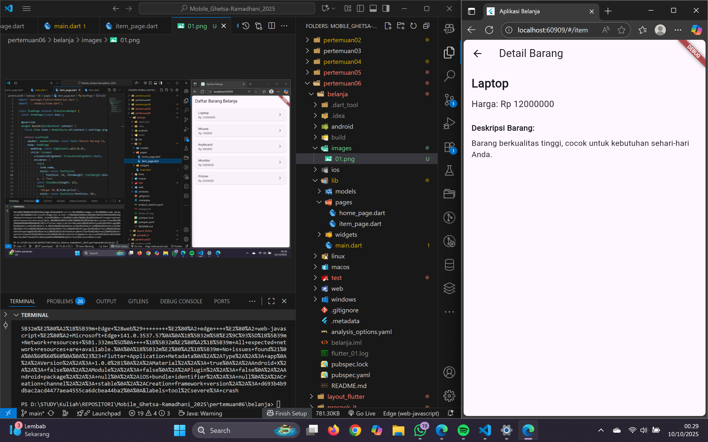
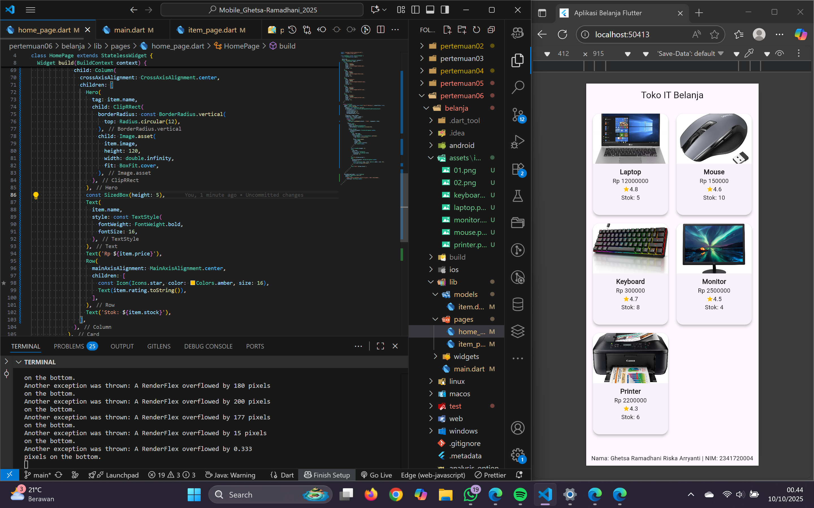
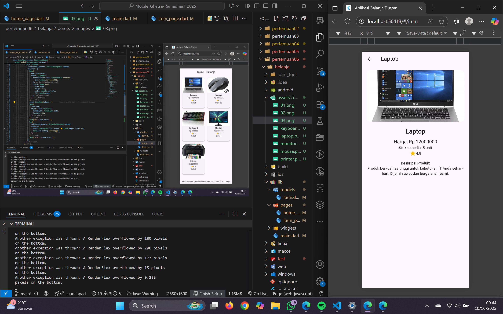

# Praktikum 5 & Tugas 2 Flutter – Navigasi dan Hero Animation

## Deskripsi

Aplikasi Flutter sederhana bertema toko IT yang menampilkan daftar barang dalam tampilan GridView. Pengguna dapat mengetuk produk untuk melihat detailnya menggunakan navigasi antar halaman.

## Fitur

- Navigasi antar halaman dengan `Navigator` dan `ModalRoute`
- Hero Animation antara gambar di HomePage dan ItemPage
- Menampilkan atribut: nama, harga, stok, dan rating
- GridView bergaya marketplace
- Footer dengan Nama dan NIM

## Tampilan

### Praktikum 5

### Tugas Praktikum 2

**Nama:** Ghetsa Ramadhani Riska Arryanti  
**NIM:** 2341720004
