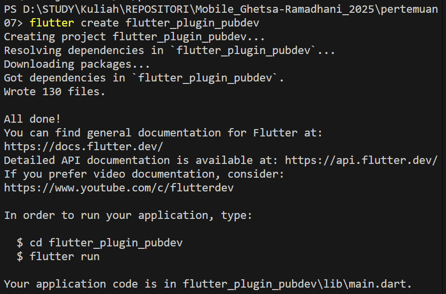
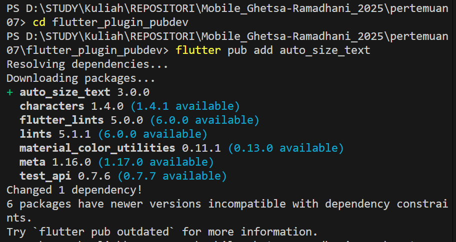
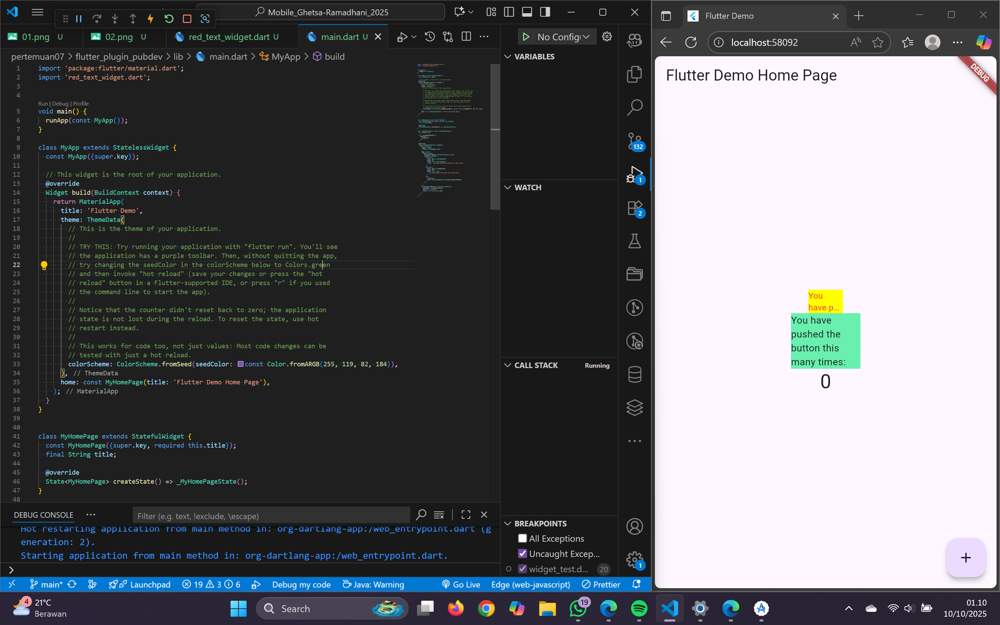
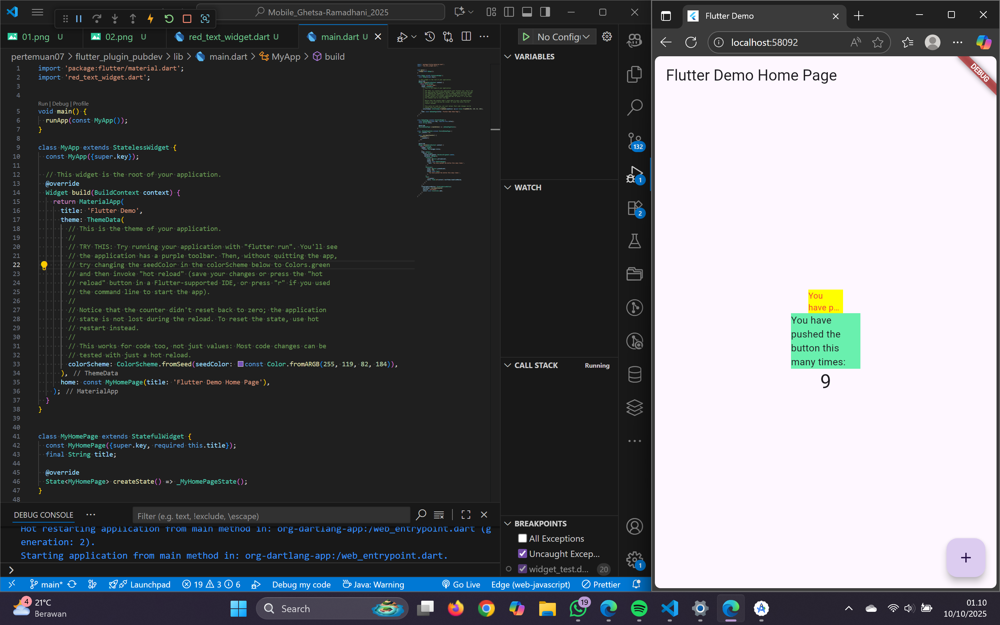

# 🧩 Praktikum & Tugas Praktikum Manajemen Plugin
**Mata Kuliah:** Pemrograman Mobile  
**Topik:** Plugin auto_size_text   
**Nama:** Ghetsa Ramadhani Riska Arryanti  
**Kelas:** 3D - D4 Teknik Informatika 
**NIM:** 2341720004

## Deskripsi

Praktikum ini bertujuan untuk mempelajari cara menambahkan dan menggunakan plugin dari **pub.dev** dalam proyek Flutter. Plugin yang digunakan adalah **auto_size_text**, yang memungkinkan teks menyesuaikan ukuran font secara otomatis agar tidak terpotong.

## Fitur

- Implementasi plugin `auto_size_text` dari pub.dev  
- Membuat custom widget `RedTextWidget` dengan teks berwarna merah  
- Perbandingan tampilan antara `AutoSizeText` dan widget `Text` bawaan  
- Penjelasan parameter plugin `auto_size_text`  
- Dokumentasi hasil dalam README.md

## Penjelasan Singkat

- **Langkah 2:** Menambahkan plugin `auto_size_text` ke proyek agar dapat digunakan untuk mengatur teks otomatis sesuai ruang tampilan.  
- **Langkah 5:** Menambahkan variabel `text` dan parameter di constructor agar widget dapat menerima input teks dari luar.  
- **Langkah 6:**  
  - `RedTextWidget` menggunakan `AutoSizeText`, teks menyesuaikan ukuran dan tidak terpotong.  
  - `Text` biasa tidak menyesuaikan ukuran, bisa overflow jika ruang sempit.  

## Parameter auto_size_text

- `text`: isi teks yang akan ditampilkan  
- `style`: gaya teks (warna merah, ukuran font 14)  
- `maxLines`: jumlah baris maksimum yang ditampilkan  
- `overflow`: cara menampilkan teks berlebih (`TextOverflow.ellipsis` menambah “...”)  

## Tampilan

