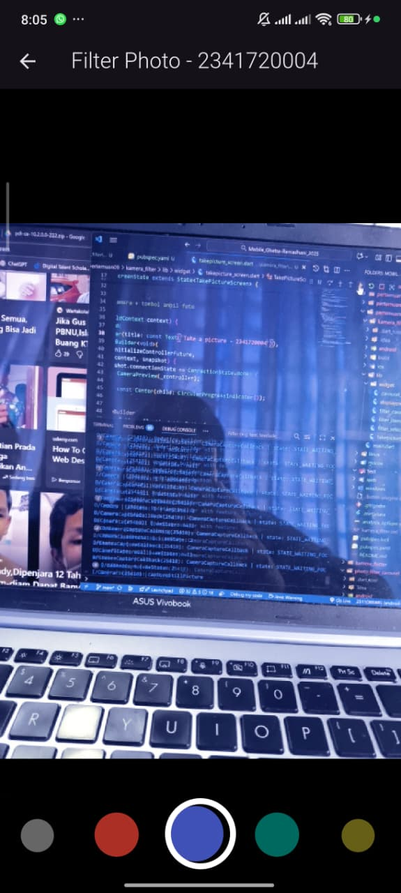

# 📱 Praktikum Flutter - Kamera dan Filter Carousel

✍️ **Disusun oleh:**  
Nama: _Ghetsa Ramadhani Riska Arryanti_  
Kelas: _TI-3D_  
Absen: _12_
NIM: _2341720004_
Mata Kuliah: _Pemrograman Mobile_

---

## 🧩 Deskripsi Tugas
Pada tugas praktikum ini, kami menyelesaikan **Praktikum 1** dan **Praktikum 2** kemudian **menggabungkannya** menjadi satu aplikasi Flutter.  
Aplikasi ini memiliki dua fitur utama:
1. **Mengambil foto menggunakan kamera.**
2. **Menampilkan hasil foto dengan filter carousel.**

Hasil dari kedua praktikum digabungkan agar setelah pengguna mengambil foto, hasilnya dapat langsung ditampilkan dalam bentuk **carousel dengan efek filter**.

---

## 🧪 Praktikum 1 – Mengambil Foto dengan Kamera

### 📸 Deskripsi
Praktikum pertama berfokus pada cara menggunakan kamera di Flutter menggunakan package `camera`.  
Pengguna dapat membuka kamera dan mengambil foto, kemudian hasil foto akan ditampilkan pada layar aplikasi.

### 💻 Cuplikan Kode Utama
```dart
Future<void> main() async {
  WidgetsFlutterBinding.ensureInitialized();
  final cameras = await availableCameras();
  final firstCamera = cameras.first;

  runApp(MyApp(camera: firstCamera));
}
```

### 🖼️ Screenshot Hasil


### ✍️ Penjelasan
Pada kode di atas, kamera diinisialisasi terlebih dahulu sebelum menjalankan aplikasi dengan `WidgetsFlutterBinding.ensureInitialized()` agar sistem kamera siap digunakan.  
Kemudian, hasil foto disimpan dan ditampilkan pada tampilan utama.

---

## 🎨 Praktikum 2 – Filter Carousel

### 📸 Deskripsi
Praktikum kedua menambahkan fitur **carousel filter**, di mana pengguna dapat melihat hasil foto dengan berbagai efek filter seperti grayscale, sepia, dan lainnya.

### 💻 Cuplikan Kode Utama
```dart
CarouselSlider(
  items: filters.map((filter) {
    return ColorFiltered(
      colorFilter: filter,
      child: Image.file(File(imagePath)),
    );
  }).toList(),
  options: CarouselOptions(
    height: 400,
    enlargeCenterPage: true,
    enableInfiniteScroll: false,
    autoPlay: false,
  ),
)
```

### 🖼️ Screenshot Hasil


### ✍️ Penjelasan
`CarouselSlider` digunakan untuk menampilkan beberapa versi dari foto yang sama, masing-masing dengan efek filter yang berbeda.  
`ColorFiltered` memberikan efek visual pada gambar dengan kombinasi warna yang telah ditentukan.

---

## 🔗 Gabungan Praktikum 1 dan 2

### 📸 Deskripsi
Pada tahap ini, hasil dari **pengambilan foto (Praktikum 1)** digabungkan dengan **tampilan filter carousel (Praktikum 2)**.  
Setelah pengguna mengambil foto, hasilnya langsung ditampilkan dalam carousel filter.

### 🖼️ Screenshot Hasil Akhir



### ✍️ Penjelasan
Integrasi dilakukan dengan menambahkan navigasi otomatis ke halaman carousel setelah foto berhasil diambil.  
Parameter `imagePath` dikirim ke halaman carousel agar dapat menampilkan foto tersebut dengan berbagai filter.

---

## 💡 Pertanyaan & Jawaban

### 1. Apa maksud dari `void async` pada Praktikum 1?
`void async` digunakan untuk menandai bahwa fungsi tersebut berjalan secara **asinkron**.  
Artinya, fungsi tersebut dapat menjalankan operasi yang memerlukan waktu (seperti membuka kamera atau mengambil foto) **tanpa menghentikan eksekusi kode lain**.  
Kata kunci `async` membuat fungsi dapat menggunakan `await` untuk menunggu hasil dari operasi asinkron, seperti:
```dart
final cameras = await availableCameras();
```

---

### 2. Apa fungsi dari anotasi `@immutable` dan `@override`?

#### 🧱 `@immutable`
Digunakan pada kelas Flutter (biasanya `Widget`) untuk menandakan bahwa **objek tidak boleh diubah** setelah dibuat.  
Contoh:
```dart
@immutable
class MyWidget extends StatelessWidget {
  final String title;
  const MyWidget({super.key, required this.title});
}
```
➡️ Artinya, nilai `title` tidak dapat diubah setelah objek `MyWidget` dibuat.

#### 🔁 `@override`
Digunakan ketika **menimpa (override)** method dari kelas induk (superclass).  
Hal ini memberi tahu kompiler bahwa method tersebut dimaksudkan untuk menggantikan implementasi dari parent class.
Contoh:
```dart
@override
Widget build(BuildContext context) {
  return Text('Halo Dunia');
}
```
➡️ Method `build` di atas menggantikan method `build` bawaan dari `StatelessWidget`.
