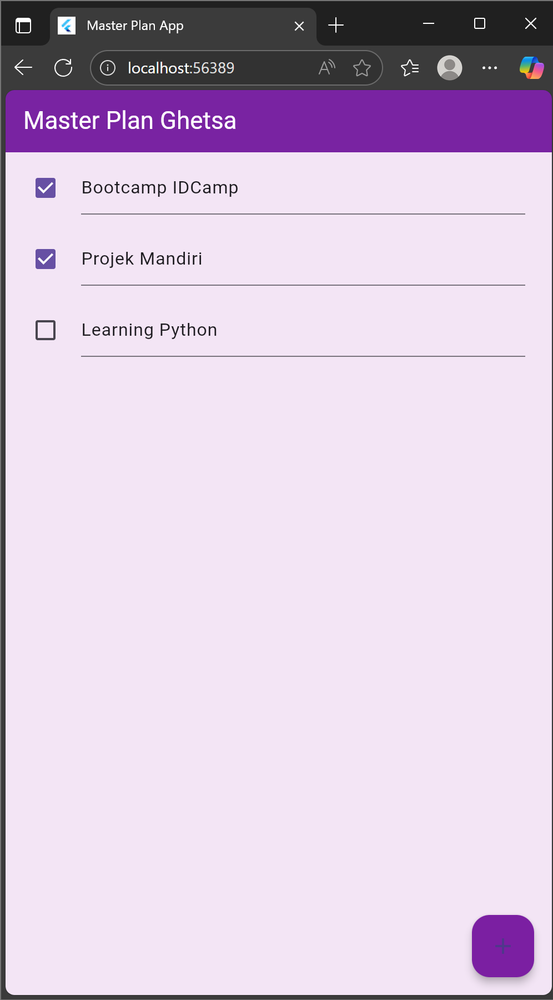

# 🧩 Praktikum 1: Dasar State dengan Model-View
**Mata Kuliah:** Pemrograman Mobile  
**Topik:** State Management dan Pemisahan Model-View   
**Nama:** Ghetsa Ramadhani Riska Arryanti  
**Kelas:** 3D - D4 Teknik Informatika 
**NIM:** 2341720004

## 📘 Deskripsi

Praktikum ini bertujuan untuk memahami **konsep dasar state management** pada Flutter menggunakan pendekatan **Model-View**.  
Mahasiswa diminta membuat aplikasi sederhana bernama **Master Plan**, yang digunakan untuk mencatat daftar tugas (*to-do list*) dengan fitur tambah tugas, ubah status tugas, serta pengelolaan tampilan menggunakan `StatefulWidget` dan `ScrollController`.

## ⚙️ Fitur Aplikasi

- Penerapan konsep **Model-View Separation**  
- Penggunaan **StatefulWidget** untuk mengelola perubahan data secara real-time  
- Tambah dan ubah status tugas menggunakan tombol dan checkbox  
- Penanganan scroll serta keyboard behavior dengan **ScrollController**  

---

## 🧠 Soal dan Penjelasan Langkah-langkah Penting

### Jelaskan maksud dari langkah 4 pada praktikum tersebut! Mengapa dilakukan demikian?

**Langkah 4: File `data_layer.dart`**
Pada langkah ini dibuat file `data_layer.dart` berisi:
```dart
export 'plan.dart';
export 'task.dart';
```
**Tujuan:**  
Langkah ini dilakukan untuk **menggabungkan ekspor file model** ke dalam satu file.  
Dengan demikian, di bagian view cukup menuliskan:
```dart
import '../models/data_layer.dart';
```
➡️ Hal ini dilakukan agar proses import menjadi **lebih ringkas, efisien, dan rapi**, terutama ketika jumlah file model semakin banyak.

---

### Mengapa perlu variabel plan di langkah 6 pada praktikum tersebut? Mengapa dibuat konstanta ?

**Langkah 6: Variabel `plan`**
```dart
Plan plan = const Plan();
```
**Mengapa diperlukan?**  
Variabel `plan` berfungsi sebagai **penyimpanan utama (state)** yang memuat daftar seluruh tugas (`tasks`) dalam aplikasi.  
Setiap perubahan yang dilakukan pengguna (menambah, mengedit, atau menyelesaikan tugas) akan memperbarui nilai `plan` melalui `setState()`.

**Mengapa dibuat konstanta (`const`)?**  
Karena pada awal pembuatan state belum ada data yang berubah, `const` digunakan agar instance awal `Plan` bersifat **immutable** dan dapat dioptimalkan oleh Flutter untuk performa lebih baik.

---

### Lakukan capture hasil dari Langkah 9, kemudian jelaskan apa yang telah Anda buat!

**Langkah 9: Hasil (List Tugas Dinamis)**

#### 📸 Tampilan Aplikasi
> 

#### 💬 Penjelasan
Pada langkah ini ditambahkan tiga method utama:
1. `_buildAddTaskButton()` → tombol `+` untuk menambah tugas baru  
2. `_buildList()` → menampilkan daftar tugas dengan `ListView.builder()`  
3. `_buildTaskTile()` → menampilkan setiap tugas dalam bentuk `Checkbox` dan `TextFormField`  

Ketika tombol `+` ditekan, `plan.tasks` diperbarui dengan `setState()`.  
Flutter secara otomatis merender ulang tampilan sehingga daftar tugas baru langsung muncul tanpa memuat ulang seluruh aplikasi.

---

### Apa kegunaan method pada Langkah 11 dan 13 dalam lifecyle state ?

**Langkah 11 dan 13: Lifecycle Method (`initState` dan `dispose`)**

#### `initState()`
Digunakan untuk **inisialisasi awal** widget, termasuk:
- Membuat objek `ScrollController`
- Menambahkan listener untuk **menghapus fokus dari TextField** saat pengguna melakukan scroll

```dart
@override
void initState() {
  super.initState();
  scrollController = ScrollController()
    ..addListener(() {
      FocusScope.of(context).requestFocus(FocusNode());
    });
}
```

#### `dispose()`
Digunakan untuk **membersihkan resource** yang tidak lagi dipakai ketika widget dihapus dari tree, agar tidak terjadi kebocoran memori.

```dart
@override
void dispose() {
  scrollController.dispose();
  super.dispose();
}
```

➡️ Kedua method ini termasuk bagian dari **lifecycle StatefulWidget**, berfungsi memastikan widget bekerja efisien dan bebas error dalam jangka panjang.

---